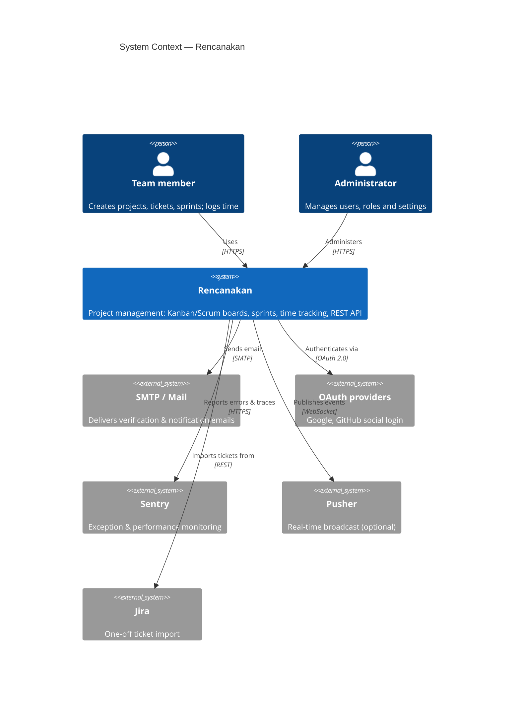
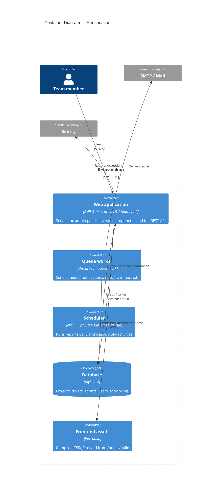
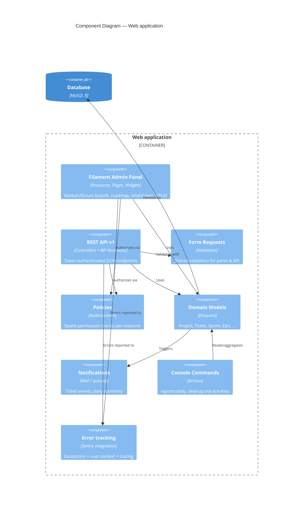

# Architecture

Rencanakan is a Laravel 9 project‑management application. The admin experience
is built with the [Filament](https://filamentphp.com) TALL‑stack panel
(Livewire + Alpine + Tailwind), and a versioned REST API exposes the same domain
to external clients.

This document describes the architecture using the
[C4 model](https://c4model.com): **Context → Container → Component**.

## Level 1 — System Context

Who uses the system and what it talks to.

## Level 2 — Containers

The deployable/runtime pieces.

> **Note on defaults.** Out of the box `CACHE_DRIVER`, `SESSION_DRIVER` and
> `FILESYSTEM_DISK` are file/local, and `QUEUE_CONNECTION` is `database`.
> Redis and Pusher are supported but optional. In development the queue can run
> synchronously (`QUEUE_CONNECTION=sync`).

## Level 3 — Components (inside the Web application)

How the Laravel application is organised.

## Key cross-cutting concerns

| Concern | Where | Notes |
|---------|-------|-------|
| **Authentication** | Filament Breezy (panel), Sanctum tokens (API), Socialite (Google/GitHub) | Panel access gated by `User::canAccessFilament()` (must hold a role) |
| **Authorization** | Spatie Permission + Policies | Every resource has a policy; API also checks project membership |
| **Rate limiting** | `RouteServiceProvider` + middleware | API 100/min per token, public 60/min per IP, login 5/min, `internal` IP‑whitelist |
| **Atomicity** | `DB::transaction` | Ticket creation, sprint start, batch ops, Jira import |
| **Performance** | Eager loading + widget caching (1h TTL) | See `Project::statistics()` and `WithCachedData` |
| **Observability** | Sentry + query log channel | Enabled via env; no-op without a DSN |

See also: [Database schema](database-schema.md) · [API](api.md) · [Deployment](deployment.md)
