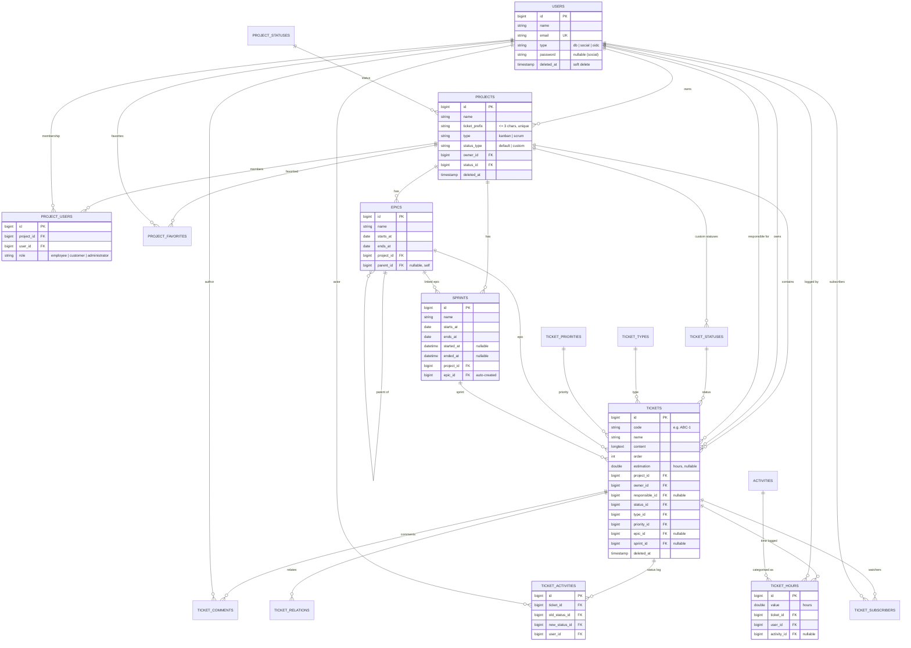

# Database Schema

MySQL 8, managed entirely through Laravel migrations (`database/migrations`).
The schema has **32 tables**: the project‑management domain, reference data, and
supporting framework tables.

## Entity–Relationship diagram (core domain)

## Table reference

### Core domain

| Table | Purpose | Key columns |
|-------|---------|-------------|
| `projects` | A project (Kanban or Scrum) | `owner_id`, `status_id`, `ticket_prefix`, `type`, `status_type` |
| `tickets` | Work item / issue | `code`, `project_id`, `owner_id`, `responsible_id`, `status_id`, `type_id`, `priority_id`, `epic_id`, `sprint_id`, `estimation`, `order` |
| `sprints` | Time‑boxed iteration | `project_id`, `epic_id`, `starts_at`, `ends_at`, `started_at`, `ended_at` |
| `epics` | Large body of work (roadmap) | `project_id`, `parent_id`, `starts_at`, `ends_at` |

### Ticket collaboration

| Table | Purpose |
|-------|---------|
| `ticket_comments` | Discussion on a ticket (`ticket_id`, `user_id`, `content`) |
| `ticket_activities` | Status‑change audit log (`old_status_id` → `new_status_id`, `user_id`) |
| `ticket_hours` | Logged time (`value` in hours, optional `activity_id`) |
| `ticket_relations` | Links between tickets (`relation_id`, `type`) |
| `ticket_subscribers` | Watchers (`ticket_id`, `user_id`) |

### Reference data

| Table | Purpose |
|-------|---------|
| `project_statuses` | Project status options (`is_default`) |
| `ticket_statuses` | Ticket status; `project_id` null = global, set = per‑project custom |
| `ticket_types` | Ticket type (Bug, Feature, …) with `icon`/`color` |
| `ticket_priorities` | Priority levels |
| `activities` | Time‑tracking categories (Development, Meeting, …) |

### Membership & access

| Table | Purpose |
|-------|---------|
| `project_users` | Project membership with pivot `role` |
| `project_favorites` | Per‑user favorited projects |
| `users` | Accounts (`type` = db/social/oidc, nullable password for social) |
| `roles`, `permissions`, `model_has_roles`, `model_has_permissions`, `role_has_permissions` | Spatie RBAC |

### Framework & support

`migrations`, `password_resets`, `personal_access_tokens` (Sanctum),
`sessions`/`cache` (if configured), `jobs`, `failed_jobs`, `notifications`,
`media` (Spatie Media Library), `settings` (Spatie Settings),
`socialite_users`, `pending_user_emails`.

## Conventions

- **Soft deletes** on domain tables (`projects`, `tickets`, `sprints`, `epics`,
  statuses/types/priorities, `users`, `activities`) via a `deleted_at` column —
  records are hidden, not destroyed. Relations use `withTrashed()` so history
  stays readable.
- **Ticket `code`** (`PREFIX-N`) and **`order`** are generated automatically in
  the `Ticket` model's `creating` hook.
- **Every sprint auto‑creates a linked epic** (see `Sprint::boot`), so a sprint
  always appears on the roadmap.
- `ticket_activities` has **no soft delete**; it is pruned by
  `php artisan cleanup:old-activities` (archived to file, then removed).

> ⚠️ The `settings` table has no unique index on `(group, name)` — MySQL
> tolerates this but SQLite (used in tests) cannot upsert, so tests fake the
> settings instead of persisting them.
